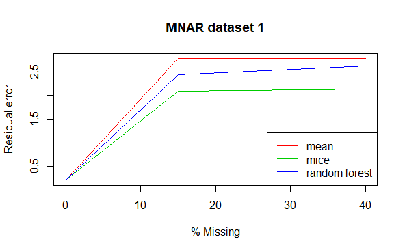
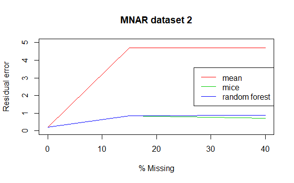
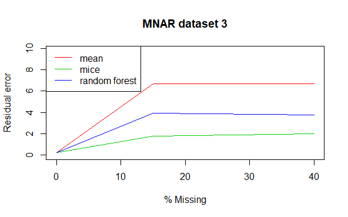

```{r setup, include=FALSE}
knitr::opts_chunk$set(echo = TRUE)

rm(list=ls())
```

## Imputation

The goal of this project is to compare the performance of three imputation methods:

1.  Simple imputation with the mean

2.  Multiple imputation using chained equations (MICE)

3.  Random forests

Three simulated datasets with varying structures are used in this project. For each dataset, we will create dataframes with 15% missingness, and 40% missingness using missing completely at random (mcar) and missing not at random (mnar). The 3 methods above will then be used to impute the missing values. In total, we will have 7 unique data frames from each of the 3 simulated datasets that we can fit linear regression models to.

First lets load the required packages, helper functions and data frame

```{r, echo = TRUE, warning = FALSE, message=FALSE}
library(missForest)
library(mice)
library(doParallel)
library(Hmisc)
library(corrplot)

source('functions_imputation.R')
load('simulated_data.Rdata')
```

Now lets quickly explore the list of data frames by examining the first 6 rows, the correlation between variables, and how the variables are distributed.

```{r}
# Look at first 6 rows of the 3 datasets
head(data.list[[1]]) 
head(data.list[[2]]) 
head(data.list[[3]]) 

# Look at correlation between variables in the datasets 
par(mfrow = c(1, 3)) # Plot 3 graphs in one row 
corrplot(cor(data.list[[1]]), tl.cex = 0.4, title = "dataset 1")
corrplot(cor(data.list[[2]]), tl.cex = 0.4, title = "dataset 2")
corrplot(cor(data.list[[3]]), tl.cex = 0.4, title = "dataset 3")
```

We see that each dataset has 40 explanatory variables, and one outcome variable Y. The variables in the first two datasets are all continuous, with some possible categorical variables defined as integer values in the third.

From the correlation plots, we see that the explanatory variables in the first dataset have very low correlation with each other, as well as with the outcome variable Y. While the 2nd dataset is highly correlated and the 3rd is in between the two. We predict that datasets with higher correlation will be better fit for imputation. Datasets with lower correlation hold a lot of independent variables and holds more information; imputation will perform worse on these data structures.

Next, lets look at the distribution of variables in each dataset.

```{r}
par(mfrow = c(5, 10), mar = c(4,1,1,1))
# Look at variable distributions 
hist.data.frame(data.list[[1]], mtitl = "dataset 1")
hist.data.frame(data.list[[2]], mtitl = "dataset 2")
hist.data.frame(data.list[[3]], mtitl = "dataset 3")
```

From the histograms, we see that all the variables are normally distributed in both datasets 1 and 2, while dataset 3 contains a mixture of normally distributed and skewed variables. We don't expect these differences to impact imputation performance as there are no outliers in any of the distributions. As we are performing linear regression and there is no assumption of distribution aside from linearity.

## Input Parameters

```{r input}
train_prop  <- 0.25    # Proportion of data for training set
outcome_var <- "Y"     # Name of the outcome variable for linear regression

rf_iter     <- 5       # Number of iterations for random forest
n_tree      <- 500     # Number of trees for random forest

mice_iter   <- 20      # Number of iterations for MICE 
mice_m      <- 5       # Number of multiple imputations for MICE 
mice_method <- "pmm"   # Imputation method for MICE

seed        <- 1234    # Seed for reproducable results

#specify the proportion and type of missingness
miss_prop_list <- c(0.15, 0.40)
miss_type_list <- c('mcar', 'mnar')

#set the data, missingness proportion and missingness type for an iteration
data_indx <- 1 
miss_prop_indx <- 1 
miss_type_indx <- 1
```

Based on the input, select the dataset(1, 2 or 3), missingness proportion (0.15 or 0.40), missingness type (mcar, mnar), and list of predictor variables

```{r}
data <- data.list[[data_indx]]
miss_prop <- miss_prop_list[miss_prop_indx]
miss_type <- miss_type_list[miss_type_indx]

#list of predictors
pred_var   <- colnames(data)[-which(colnames(data) == outcome_var)] 
n_pred_var <- length(pred_var) # number of predictors

```

## Split Training & Test Sets

```{r}
# Sample row index to use as training data 
set.seed(seed)
train_indx <- sample(x = 1:dim(data)[1], 
                     size = dim(data)[1] * train_prop, 
                     replace = FALSE)

train_set <- data[train_indx,] # take training index 
test_set  <- data[-train_indx,]# take everything that isn't training index
```

## Induce Missingness

Note that we only want missingness in the predictor variables

```{r}
train_set_miss <- train_set

set.seed(seed)
train_set_miss[,pred_var] <- add_miss(df = train_set_miss[,pred_var],
                                      prop = miss_prop, 
                                      misstype = miss_type)
```

## Simple Imputation Using Means

\*Assuming everything is numeric

```{r}
mean_data <- imp_mean(train_set_miss)
```

## Impute Using MICE

```{r, include = FALSE}

mice_data <- train_set_miss
mice_list <- mice(train_set_miss[pred_var], 
                  m = mice_m, 
                  method = mice_method,
                  maxit  = mice_iter)

for (i in 1:n_pred_var){
  dat_temp <- mice_list$imp[[pred_var[i]]]
  data_est <- apply(dat_temp, 1, mean)
  mice_data[names(data_est), pred_var[i]] <- data_est
}

```

```{r, eval = FALSE}

mice_data <- train_set_miss
mice_list <- mice(train_set_miss[pred_var], 
                  m = mice_m, 
                  method = mice_method,
                  maxit  = mice_iter)

for (i in 1:n_pred_var){
  dat_temp <- mice_list$imp[[pred_var[i]]]
  data_est <- apply(dat_temp, 1, mean)
  mice_data[names(data_est), pred_var[i]] <- data_est
}
```

## Impute Using Random Forest

```{r}
temp_rf <- missForest(train_set_miss[pred_var], 
                      maxiter = rf_iter, 
                      ntree = n_tree)

rf_data <- train_set_miss

for (i in 1:n_pred_var){
  rf_data[pred_var[i]] <- temp_rf$ximp[pred_var[i]]
}
```

## Fit Linear Models

```{r}
# Null Model (Intercept)
fit_null <- lm(Y~1, data = train_set)  

# Full Models (All Predictors)
fit      <- lm(Y~., data = train_set)  # original training set
fit_mean <- lm(Y~., data = mean_data)  # imputed mean
fit_mice <- lm(Y~., data = mice_data)  # imputed mice
fit_rf   <- lm(Y~., data = rf_data)    # imputed random forest
```

## Generate Predictions on Test Set

```{r}
# Null Model
p_null <- predict(fit_null, newdata = test_set)

# Full Models
p      <- predict(fit,      newdata = test_set) 
p_mean <- predict(fit_mean, newdata = test_set) 
p_mice <- predict(fit_mice, newdata = test_set) 
p_rf   <- predict(fit_rf,   newdata = test_set)
```

## Calculate Prediction Error

```{r}
# Mean Squared Error
mse_null  <- mean((test_set$Y - p_null)^2)
mse       <- mean((test_set$Y - p)^2)
mse_mean  <- mean((test_set$Y - p_mean)^2)
mse_mice  <- mean((test_set$Y - p_mice)^2)
mse_rf    <- mean((test_set$Y - p_rf)^2)

# Residual Error 
re      <- mse/mse_null
re_mean <- mse_mean/mse_null
re_mice <- mse_mice/mse_null
re_rf   <- mse_rf/mse_null

# Organize errors and print
df_mse_re <- data.frame(mse = c(mse_null, mse, mse_mean, mse_mice, mse_rf),
                        re = c(NA, re, re_mean, re_mice, re_rf))
rownames(df_mse_re) <- c("Null", "Original", "Mean", "MICE", "RF")

print(df_mse_re)
```

## Results

|                   |                |
|-------------------|----------------|
|  |  |
|  |  |
|  |  |

From the graphs above we can see that with larger proportions of data missing, the performance of all 3 methods decrease, especially around 15% missing. When correlation is present in the data and missingness is completely at random, you are able to recover the structure well using any of the three methods up to around 15% missing. Afterwards, the performance of simple imputation with the mean falls drastically while mice and random forest work well even with 40% missing. When there is no correlation between variables and the data is missing at random, all 3 methods don't perform well. In datasets where data missing not at random, you may try applying methods below 10% or 15% missingness, otherwise too much of the signal is lost. All methods had higher residual errors when the data was MNAR compared to MCAR.

Mice and random forest have similar performances except when there is medium correlation between the variables and the data is missing not at random. Here, mice is able to detect a finer signal in the data than random forest which is more robust. Both of these methods tended to perform better than mean, though there are some situations where simple imputation is sufficient.

In conclusion it seems that when your data is highly correlated, and when missingness is completely at random it is justifiable to use imputation. When the missingness is not at random, it may be justifiable to impute at low percentages of missingness and when your variables are correlated.
