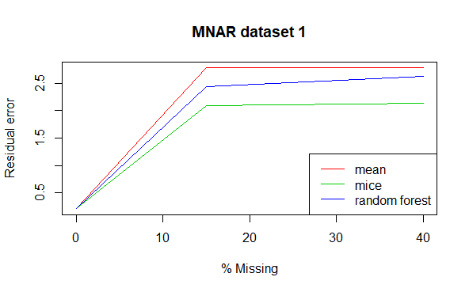
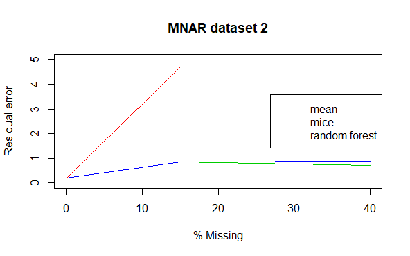

Imputation
================
Linda Luu

## Imputation

The goal of this project is to compare the performance of three
imputation methods:

1.  Simple imputation with the mean

2.  Multiple imputation using chained equations (MICE)

3.  Random forests

Three simulated datasets with varying structures are used in this
project. For each dataset, we will create dataframes with 15%
missingness, and 40% missingness using missing completely at random
(mcar) and missing not at random (mnar). The 3 methods above will then
be used to impute the missing values. In total, we will have 7 unique
data frames from each of the 3 simulated datasets that we can fit linear
regression models to.

First lets load the required packages, helper functions and data frame

``` r
library(missForest)
library(mice)
library(doParallel)
library(Hmisc)
library(corrplot)

source('functions_imputation.R')
load('simulated_data.Rdata')
```

Now lets quickly explore the list of data frames by examining the first
6 rows, the correlation between variables, and how the variables are
distributed.

``` r
# Look at first 6 rows of the 3 datasets
head(data.list[[1]]) 
```

    ##           VAR1        VAR2        VAR3        VAR4       VAR5        VAR6
    ## 596  0.6989029  0.34948952  0.03258104  0.31651466 -1.1314169 -0.87129143
    ## 915  1.3628909  0.05256954 -1.28518574  0.59446982  0.4011272 -2.32249085
    ## 648 -1.6116448 -0.32360772 -2.21289435  0.50378804 -0.2377069  0.76929016
    ## 284 -0.1014087 -0.65414657 -2.53013354  0.05000707 -1.8997250  1.12879885
    ## 654 -0.7165909 -0.88878255 -1.46255627  1.81708708 -1.5854877 -0.07729813
    ## 334 -1.6447395  2.00247935 -1.14125833 -1.44754949  0.1378022 -0.26133484
    ##           VAR7       VAR8       VAR9      VAR10      VAR11       VAR12
    ## 596 -1.1452720  0.9961848  0.3860657 -0.6455337  1.5510156 -0.25764610
    ## 915 -0.6328188 -1.0957412  0.1356571  1.8211519 -1.2891468  0.34248746
    ## 648 -1.4453644  0.2965800  1.9393126 -0.2845300 -0.8832718  0.01467795
    ## 284 -0.1057045 -2.3742188  0.6853789 -0.3193019  0.9441054 -2.08548720
    ## 654  1.4853434  1.2897613 -1.2343694  0.6990348  1.1143226  0.59192021
    ## 334 -0.7116922  0.7745927 -0.9959818  0.8032995 -1.2257992 -0.64916921
    ##          VAR13      VAR14      VAR15      VAR16      VAR17       VAR18
    ## 596 -1.3296497  0.6605854  0.5913519 -0.9216790  1.5171295  1.79115321
    ## 915 -0.7494359  0.5214870  0.1648335 -0.6280462 -0.4937843 -0.03477427
    ## 648 -1.0723030 -2.0237586  1.1741627 -1.7406104 -0.2804889 -0.27736192
    ## 284 -0.8690016 -1.2530948  0.2733245  1.5787639  0.1160108  0.03825493
    ## 654  0.6348421 -0.1288763  1.0723078 -0.8717183  0.5715816  0.18702008
    ## 334 -0.2016211  0.1357435 -0.3288477 -2.1204782  2.2812649 -2.70982832
    ##          VAR19      VAR20      VAR21     VAR22      VAR23     VAR24       VAR25
    ## 596  0.7565490  0.3872525 -0.1134594 0.7690123  0.5660888 1.0414989  1.49998786
    ## 915 -0.5762933 -1.6806525  0.6176337 1.5101754  0.1993817 0.6122176 -0.42559592
    ## 648  0.1620523  1.3341432 -1.4793723 0.8676076 -0.7760521 0.9553179  0.74381934
    ## 284 -2.1191868  2.4354687  0.6819588 0.1768930 -2.1874056 0.4795804  2.10925552
    ## 654  0.1286729  2.4709240 -0.3918549 0.9279759 -1.0033760 0.4135717  0.04865508
    ## 334 -0.8904500 -0.2739096 -2.5486624 0.4519125 -1.6279137 1.3608301 -2.68454895
    ##          VAR26      VAR27       VAR28     VAR29      VAR30      VAR31
    ## 596 -0.2053318 -0.5685032  0.75523642 0.5000422  0.8682685 -0.7626179
    ## 915  0.8945650 -2.4183632  1.58612431 0.2196865 -0.2572702  0.8067298
    ## 648 -1.9163468 -1.1066201 -0.08329165 0.8317779 -0.4649616 -0.9610470
    ## 284 -0.7981288  0.7732628 -1.66535916 0.5526432 -0.8052224  0.8013525
    ## 654  0.3252969  0.6618533  0.58828609 0.1692388  0.1620685  0.5342588
    ## 334  0.6424968 -3.7204297 -1.11154266 0.2994514 -0.2808095 -0.6223125
    ##          VAR32      VAR33      VAR34       VAR35      VAR36      VAR37
    ## 596  1.2322876  1.5263031 -0.2581242 -0.01989276  0.1571378  0.1851297
    ## 915 -0.9407614 -1.2713362 -0.9228256  0.63837051 -0.8092294  0.8258866
    ## 648  1.0678411 -0.4623738 -1.3817166  0.37546639 -1.6426913  0.6460322
    ## 284  0.8000179  0.3119021 -1.9184129 -2.46734515 -0.7486942 -0.1023373
    ## 654  0.8166318 -0.8992998 -1.3336577 -2.32989380  0.1239191  0.1234538
    ## 334 -0.5325463 -0.5189278 -1.4006257  0.12523717 -1.4570560  0.8805974
    ##          VAR38       VAR39      VAR40          Y
    ## 596  0.4385883  0.05134625  0.9177987  -4.043487
    ## 915 -0.1953563 -0.87992933 -0.6423036 -10.172499
    ## 648 -1.8995797 -0.31946613 -1.2033143  -9.427211
    ## 284 -0.3150345  0.98052769  0.8640830 -10.555426
    ## 654  0.8304920  0.11317218  0.1983081  15.043952
    ## 334  0.2042027 -1.04558713 -0.2642141  -2.750576

``` r
head(data.list[[2]]) 
```

    ##           VAR1       VAR2       VAR3         VAR4       VAR5       VAR6
    ## 138  1.6050791 -1.1478000  0.3123008 -0.106211420 -0.7297550 -0.4705803
    ## 494  0.8281084 -0.9559459 -0.1901045  0.360843565 -0.2423326  0.4526697
    ## 735  0.3487474 -1.9747504 -1.2597577  2.131984473  0.2363836  2.5289040
    ## 91   0.6009669  0.9725010  1.8221250  1.475080541  1.7890343  0.7499396
    ## 979 -0.1834987 -1.0459975 -0.8798024  1.783466112  0.6088574  2.1907590
    ## 841 -0.3660638  0.1999994 -0.2246183 -0.007027738  0.1082624  0.1718965
    ##           VAR7        VAR8       VAR9        VAR10      VAR11       VAR12
    ## 138 -1.1839856  0.11412128 -1.1098039  0.119309595 -0.1656290 -0.51100158
    ## 494 -0.7206268 -0.63073451 -0.9284153 -0.275577468  0.1710509 -0.03283819
    ## 735 -0.5566191 -2.98695243 -2.3035091 -1.325664154  1.2385039  0.83726601
    ## 91  -1.4204309 -0.04298393  0.7127491  2.028608460 -1.7245752  1.84290717
    ## 979 -0.2132457 -2.31292147 -1.4847412 -0.894346679  0.7639713  0.84866677
    ## 841  0.5032304 -0.12884938  0.1762829 -0.005701299  0.2634452  0.05612558
    ##          VAR13      VAR14      VAR15      VAR16      VAR17      VAR18
    ## 138  0.7955261  1.3916594  1.4593263  1.4381553 -0.4183103  1.4858036
    ## 494  0.9368972  1.0911180  0.9428404  1.0459190  0.3416005  0.6212687
    ## 735  2.5458162  2.1150821  1.1353113  1.6747155  2.2842668 -0.2578061
    ## 91   0.8426332  0.1100947 -0.7791990 -0.4143608 -1.1748098  0.7243118
    ## 979  1.6497233  1.1915722  0.3168872  0.7309716  1.7852721 -0.3893570
    ## 841 -0.1705420 -0.3352037 -0.3487248 -0.3909290  0.2878233 -0.4402795
    ##          VAR19      VAR20       VAR21      VAR22       VAR23       VAR24
    ## 138  1.1147726 -0.3274026  0.45491793  0.7857073  1.17483760 -0.04507979
    ## 494  0.2247445 -0.5603446  0.95131555  0.1349845  0.51979247  0.34250719
    ## 735 -1.1048300 -1.7806986  3.00689027 -0.8406607 -0.03193296  1.65748609
    ## 91  -1.0549977 -1.6058724 -0.38686398 -1.6154157 -1.39922365 -1.77521603
    ## 979 -1.2920117 -1.3945027  2.11054008 -1.0435472 -0.46417999  1.22405031
    ## 841 -0.2537878  0.1616398 -0.08858605 -0.1642432 -0.24321476  0.20738894
    ##          VAR25      VAR26       VAR27      VAR28      VAR29      VAR30
    ## 138 -0.6892357  0.3475443 -0.97713754  0.5770890 -0.9294817  1.2704111
    ## 494 -0.1855518  0.6268909 -0.07644082 -0.3077516 -1.0441009  0.3838128
    ## 735  0.4112475  2.0229661  1.37808367 -2.5609143 -2.6770962 -0.8146498
    ## 91  -1.8746583  1.4744860 -1.26037092 -0.4872668  0.4893931 -0.9835787
    ## 979  0.3753542  1.5826517  1.23344916 -2.1250882 -1.7663255 -1.1119355
    ## 841  0.3236586 -0.1492222  0.43436436 -0.2599104  0.1978012 -0.3352391
    ##          VAR31      VAR32      VAR33        VAR34      VAR35      VAR36
    ## 138  1.5830212  1.2557253 -0.1019952  0.701081324  0.8221943 -1.2793892
    ## 494  0.6972766  1.0925032 -0.5160521 -0.003416551  0.7300586 -0.2150477
    ## 735  0.1150197  2.4059156 -1.8838956 -1.169566971  1.4033597  1.7795576
    ## 91   0.6916513  0.2089757  1.6674958  1.732158594  1.5830904  0.1224395
    ## 979 -0.3482031  1.5195413 -1.3024252 -1.011297768  0.9755023  1.7472447
    ## 841 -0.5091526 -0.2890872 -0.1298666 -0.345908070 -0.2628421  0.3449669
    ##          VAR37       VAR38      VAR39      VAR40         Y
    ## 138  1.1071970 -0.34356152  0.2538376  0.5295099 -2.539924
    ## 494  0.3394689 -0.61958456  0.6506205  0.6487177 -2.654151
    ## 735 -0.7016255 -2.37574325  2.0141522  1.4726594 -7.095106
    ## 91  -1.2945717  1.47993537  1.4705127  1.6897183 36.464515
    ## 979 -1.0561525 -1.59663791  1.5802559  0.9797600  2.092582
    ## 841 -0.3725819 -0.03349286 -0.2354110 -0.3951095 -3.271629

``` r
head(data.list[[3]]) 
```

    ##            VAR1        VAR2       VAR3        VAR4        VAR5       VAR6
    ## 506  0.94656079  1.95936261 -1.1544225  0.37449025  0.05334742  2.1588677
    ## 155 -0.67239361 -0.24157123  0.2709571  2.84253567  0.30878538  1.8358337
    ## 781 -0.01187776 -0.74661593  0.5630421 -0.52398397 -0.09341848 -1.0183974
    ## 252  0.13588592  0.09445853 -0.5587017  0.85207128 -0.50519241  0.8705123
    ## 455 -0.22526748  0.49282067 -0.1149729 -0.44260449  0.79500804  0.3685923
    ## 1    0.60944516  0.80420993 -0.4835022 -0.06742079 -0.66777197  0.3603412
    ##            VAR7        VAR8         VAR9      VAR10 VAR11 VAR12     VAR13 VAR14
    ## 506 -0.86666594  0.01418343 -1.718538882  1.5396185     6     6 3.1265530     1
    ## 155 -0.98940141 -0.28101426  0.081060999  0.1830811     2     3 3.6729247     5
    ## 781  1.13890614 -0.33710641 -0.004581454 -0.7398044     6     3 0.1773616     2
    ## 252 -2.39182567 -0.76862645  1.470887631 -0.8892064     4     3 1.6424618     5
    ## 455  0.45029616 -0.59207384 -0.073334639 -0.8189268     8     5 1.2751253     2
    ## 1    0.07936928 -0.10524833 -1.277195246  0.4407715     6     4 0.6035923     1
    ##     VAR15    VAR16      VAR17 VAR18       VAR19    VAR20     VAR21    VAR22
    ## 506     4 5.436858 0.06782549     3 0.235025066 6.120648 0.2128926 8.174763
    ## 155     4 5.961916 1.28567731     1 0.162143410 9.524067 3.0220781 8.046024
    ## 781     3 5.912895 1.06370487     3 2.024395143 6.042584 0.3921170 6.320722
    ## 252     3 6.820696 2.24076743     2 0.003985026 5.617163 4.6621293 7.330412
    ## 455     1 5.543619 0.32783561     2 0.092590797 5.457744 1.2449696 7.690922
    ## 1       4 5.456783 0.58634739     3 1.581257183 6.024818 0.1133420 7.000692
    ##        VAR23      VAR24     VAR25    VAR26      VAR27      VAR28 VAR29 VAR30
    ## 506 8.143016 0.90753948 1.6132704 7.725792 2.26583523 1.23393779     3     4
    ## 155 5.243952 0.03122269 0.1644506 8.666102 0.01184644 0.03793542     6     1
    ## 781 5.470417 0.48239055 0.2887993 6.176003 0.47465660 0.52608891     2     2
    ## 252 6.172014 1.48111273 2.4130552 5.406554 0.29953119 0.92204947     2     7
    ## 455 6.129872 2.54324800 0.5021826 6.689346 1.00985146 0.83001264     1     3
    ## 1   6.494518 0.56833195 1.1260174 6.376841 1.02073833 0.62063467     3     3
    ##         VAR31 VAR32     VAR33    VAR34 VAR35 VAR36     VAR37       VAR38 VAR39
    ## 506 0.3760805     2 1.2938044 6.777180     8     3 0.9065519 0.064587260     2
    ## 155 1.8343683     2 0.1323388 6.480644    11     1 0.1061736 0.932592706     3
    ## 781 0.9904208     8 0.4311177 5.890354     8     3 0.4018281 2.066837102     3
    ## 252 3.2502844     2 0.0920291 7.819362    11     3 4.2821978 0.004015872     5
    ## 455 1.4912944     5 0.3968840 8.597347    11     3 1.5611885 0.101057329     4
    ## 1   0.5679381     5 0.6306264 5.967710     8     3 0.5892668 0.937421410     2
    ##     VAR40          Y
    ## 506     3 21.7209544
    ## 155     3 -2.2896067
    ## 781     3 -4.1395073
    ## 252     1 -4.9218310
    ## 455     3  0.1761577
    ## 1       3  0.8460682

``` r
# Look at correlation between variables in the datasets 
par(mfrow = c(1, 3)) # Plot 3 graphs in one row 
corrplot(cor(data.list[[1]]), tl.cex = 0.4, title = "dataset 1")
corrplot(cor(data.list[[2]]), tl.cex = 0.4, title = "dataset 2")
corrplot(cor(data.list[[3]]), tl.cex = 0.4, title = "dataset 3")
```

<!-- -->

We see that each dataset has 40 explanatory variables, and one outcome
variable Y. The variables in the first two datasets are all continuous,
with some possible categorical variables defined as integer values in
the third.

From the correlation plots, we see that the explanatory variables in the
first dataset have very low correlation with each other, as well as with
the outcome variable Y. While the 2nd dataset is highly correlated and
the 3rd is in between the two. We predict that datasets with higher
correlation will be better fit for imputation. Datasets with lower
correlation hold a lot of independent variables and holds more
information; imputation will perform worse on these data structures.

Next, lets look at the distribution of variables in each dataset.

``` r
par(mfrow = c(5, 10), mar = c(4,1,1,1))
# Look at variable distributions 
hist.data.frame(data.list[[1]], mtitl = "dataset 1")
```

<!-- -->

``` r
hist.data.frame(data.list[[2]], mtitl = "dataset 2")
```

<!-- -->

``` r
hist.data.frame(data.list[[3]], mtitl = "dataset 3")
```

<!-- -->

From the histograms, we see that all the variables are normally
distributed in both datasets 1 and 2, while dataset 3 contains a mixture
of normally distributed and skewed variables. We don’t expect these
differences to impact imputation performance as there are no outliers in
any of the distributions. As we are performing linear regression and
there is no assumption of distribution aside from linearity.

## Input Parameters

``` r
train_prop  <- 0.25    # Proportion of data for training set
outcome_var <- "Y"     # Name of the outcome variable for linear regression

rf_iter     <- 5       # Number of iterations for random forest
n_tree      <- 500     # Number of trees for random forest

mice_iter   <- 20      # Number of iterations for MICE 
mice_m      <- 5       # Number of multiple imputations for MICE 
mice_method <- "pmm"   # Imputation method for MICE

seed        <- 1234    # Seed for reproducable results

#specify the proportion and type of missingness
miss_prop_list <- c(0.15, 0.40)
miss_type_list <- c('mcar', 'mnar')

#set the data, missingness proportion and missingness type for an iteration
data_indx <- 1 
miss_prop_indx <- 1 
miss_type_indx <- 1
```

Based on the input, select the dataset(1, 2 or 3), missingness
proportion (0.15 or 0.40), missingness type (mcar, mnar), and list of
predictor variables

``` r
data <- data.list[[data_indx]]
miss_prop <- miss_prop_list[miss_prop_indx]
miss_type <- miss_type_list[miss_type_indx]

#list of predictors
pred_var   <- colnames(data)[-which(colnames(data) == outcome_var)] 
n_pred_var <- length(pred_var) # number of predictors
```

## Split Training & Test Sets

``` r
# Sample row index to use as training data 
set.seed(seed)
train_indx <- sample(x = 1:dim(data)[1], 
                     size = dim(data)[1] * train_prop, 
                     replace = FALSE)

train_set <- data[train_indx,] # take training index 
test_set  <- data[-train_indx,]# take everything that isn't training index
```

## Induce Missingness

Note that we only want missingness in the predictor variables

``` r
train_set_miss <- train_set

set.seed(seed)
train_set_miss[,pred_var] <- add_miss(df = train_set_miss[,pred_var],
                                      prop = miss_prop, 
                                      misstype = miss_type)
```

## Simple Imputation Using Means

\*Assuming everything is numeric

``` r
mean_data <- imp_mean(train_set_miss)
```

## Impute Using MICE

``` r
mice_data <- train_set_miss
mice_list <- mice(train_set_miss[pred_var], 
                  m = mice_m, 
                  method = mice_method,
                  maxit  = mice_iter)

for (i in 1:n_pred_var){
  dat_temp <- mice_list$imp[[pred_var[i]]]
  data_est <- apply(dat_temp, 1, mean)
  mice_data[names(data_est), pred_var[i]] <- data_est
}
```

## Impute Using Random Forest

``` r
temp_rf <- missForest(train_set_miss[pred_var], 
                      maxiter = rf_iter, 
                      ntree = n_tree)

rf_data <- train_set_miss

for (i in 1:n_pred_var){
  rf_data[pred_var[i]] <- temp_rf$ximp[pred_var[i]]
}
```

## Fit Linear Models

``` r
# Null Model (Intercept)
fit_null <- lm(Y~1, data = train_set)  

# Full Models (All Predictors)
fit      <- lm(Y~., data = train_set)  # original training set
fit_mean <- lm(Y~., data = mean_data)  # imputed mean
fit_mice <- lm(Y~., data = mice_data)  # imputed mice
fit_rf   <- lm(Y~., data = rf_data)    # imputed random forest
```

## Generate Predictions on Test Set

``` r
# Null Model
p_null <- predict(fit_null, newdata = test_set)

# Full Models
p      <- predict(fit,      newdata = test_set) 
p_mean <- predict(fit_mean, newdata = test_set) 
p_mice <- predict(fit_mice, newdata = test_set) 
p_rf   <- predict(fit_rf,   newdata = test_set)
```

## Calculate Prediction Error

``` r
# Mean Squared Error
mse_null  <- mean((test_set$Y - p_null)^2)
mse       <- mean((test_set$Y - p)^2)
mse_mean  <- mean((test_set$Y - p_mean)^2)
mse_mice  <- mean((test_set$Y - p_mice)^2)
mse_rf    <- mean((test_set$Y - p_rf)^2)

# Residual Error 
re      <- mse/mse_null
re_mean <- mse_mean/mse_null
re_mice <- mse_mice/mse_null
re_rf   <- mse_rf/mse_null

# Organize errors and print
df_mse_re <- data.frame(mse = c(mse_null, mse, mse_mean, mse_mice, mse_rf),
                        re = c(NA, re, re_mean, re_mice, re_rf))
rownames(df_mse_re) <- c("Null", "Original", "Mean", "MICE", "RF")

print(df_mse_re)
```

    ##                mse        re
    ## Null     141.86289        NA
    ## Original  33.99183 0.2396104
    ## Mean      32.36518 0.2281441
    ## MICE      29.39624 0.2072158
    ## RF        31.55645 0.2224433

## Results

|                   |                |
|-------------------|----------------|
|  |  |
|  |  |
|  |  |

From the graphs above we can see that with larger proportions of data
missing, the performance of all 3 methods decrease, especially around
15% missing. When correlation is present in the data and missingness is
completely at random, you are able to recover the structure well using
any of the three methods up to around 15% missing. Afterwards, the
performance of simple imputation with the mean falls drastically while
mice and random forest work well even with 40% missing. When there is no
correlation between variables and the data is missing at random, all 3
methods don’t perform well. In datasets where data missing not at
random, you may try applying methods below 10% or 15% missingness,
otherwise too much of the signal is lost. All methods had higher
residual errors when the data was MNAR compared to MCAR.

Mice and random forest have similar performances except when there is
medium correlation between the variables and the data is missing not at
random. Here, mice is able to detect a finer signal in the data than
random forest which is more robust. Both of these methods tended to
perform better than mean, though there are some situations where simple
imputation is sufficient.

In conclusion it seems that when your data is highly correlated, and
when missingness is completely at random it is justifiable to use
imputation. When the missingness is not at random, it may be justifiable
to impute at low percentages of missingness and when your variables are
correlated.
